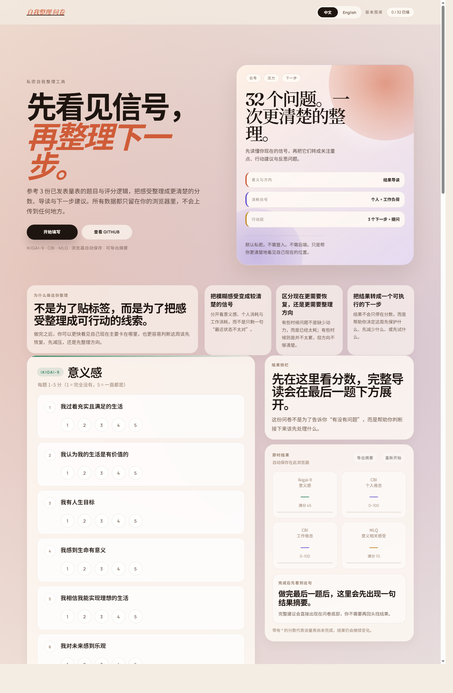

# 自我整理问卷 · Self Reflection Survey

An interactive, single-page web app for self-reflection using prompts and score logic adapted from published research questionnaires.

**Live demo:** [teohsinyee.github.io/self-reflection-survey](https://teohsinyee.github.io/self-reflection-survey/)

## Latest UI Snapshot

This image shows the latest UI captured in the repository. If you are viewing an open PR branch, the GitHub Pages demo on `main` may still be one version behind until that PR is merged.

See the [Version Gallery](docs/version-gallery.md) for archived screenshots of earlier versions and major UI changes.

## Scales included

| Scale | Full name | Items | Scoring |
|-------|-----------|-------|---------|
| **Ikigai-9** | Ikigai-9 Meaning in Life Scale | 9 | 1–5 per item, total 9–45 |
| **CBI** | Copenhagen Burnout Inventory | 13 (6 personal + 7 work) | 0/25/50/75/100, mean per subscale |
| **MLQ** | Meaning in Life Questionnaire | 10 | 1–7 per item, total 10–70 |

## Features

- Fully client-side — no data is sent to any server
- Real-time scoring as you answer
- Progress autosaves in your browser and restores after refresh
- Reverse-scored items handled automatically
- Interpretation labels shown after all questions are answered
- Completed results include a short guidance profile, suggested focus areas, 3 small next steps, and reflection prompts
- Exportable text summary for personal records or reflection
- One-click reset to start over
- Single-language mode with a Chinese / English toggle
- Responsive, works on mobile and desktop
- Editorial-style visual redesign with a stronger landing, workspace, and results presentation

## How to deploy on GitHub Pages

1. Create a new GitHub repository (public)
2. Push the project files to the repo root, including `index.html`, `styles.css`, and the `docs/` assets used by the README
3. Go to **Settings → Pages**
4. Under **Source**, select `main` branch and `/ (root)`
5. Click **Save** — your site will be live at `https://<username>.github.io/<repo-name>/`

## Local preview

Just open `index.html` directly in any browser — no build step or server needed. Keep `styles.css` in the same folder so the visual design loads correctly.

## Privacy

All responses are processed entirely in the browser. No data is transmitted or logged anywhere. If autosave is available, answers are stored only in that browser's local storage until reset.

---

*For personal reflection and educational use only. The guidance in this app is designed to help users interpret their own scores and plan small next steps; it is not medical, therapeutic, or clinical advice. For research, organizational assessment, or clinical use, please refer to the original instruments, their permissions, and validated translations.*
