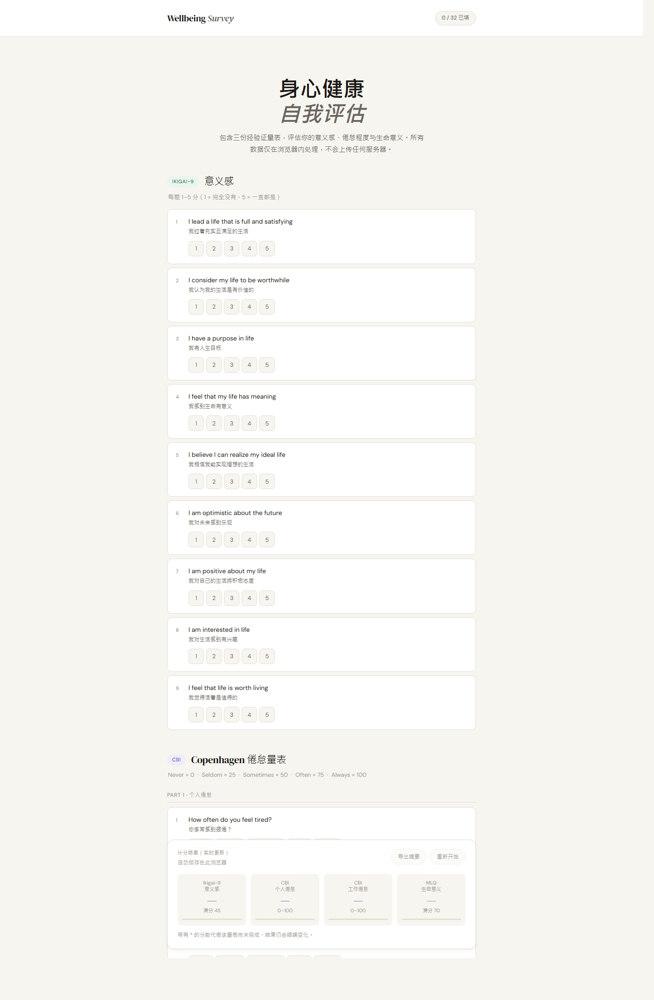
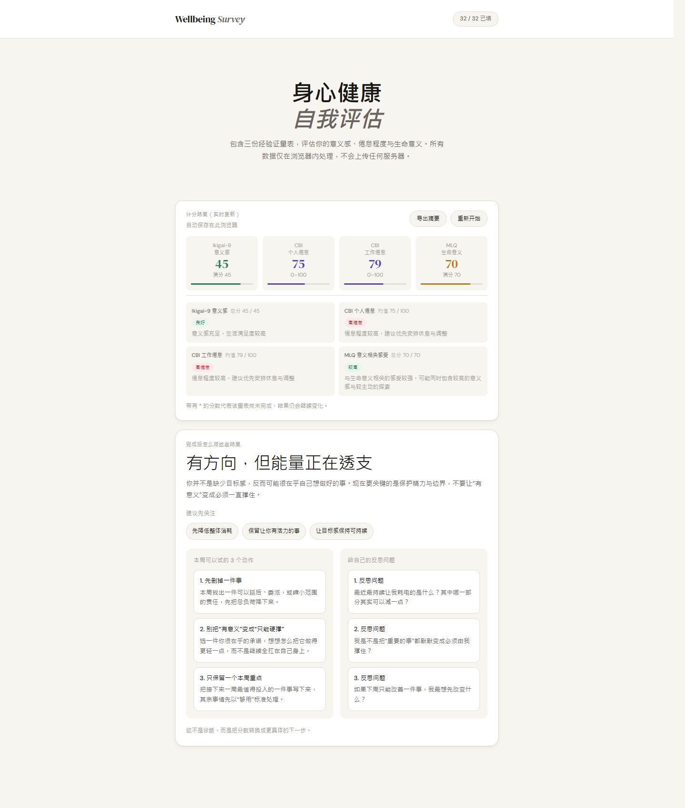
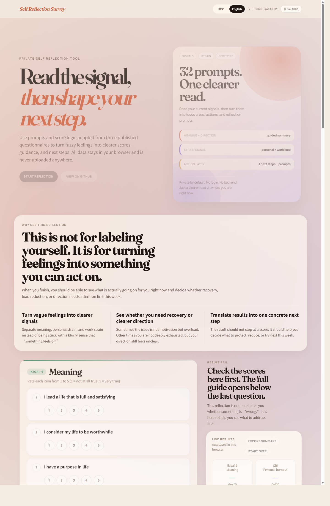
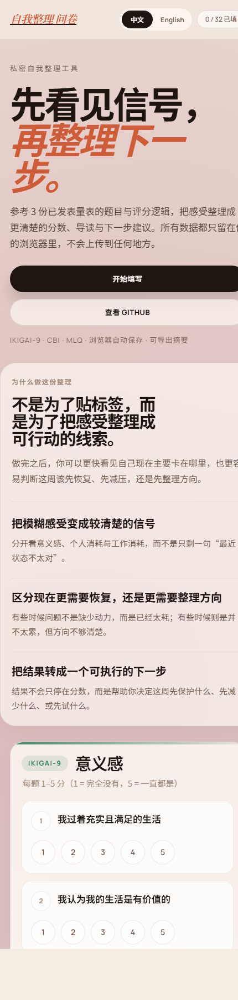

# Version Gallery

This page keeps a visual record of major UI milestones so older versions stay easy to reference even after `main` moves forward.
Each entry should point back to an immutable reference such as a commit SHA, merged PR, tag, or release.

## How We Use This

- `README.md` shows the latest UI only
- Pull requests should include before/after screenshots for review context
- This gallery keeps the longer-lived screenshot archive for portfolio and version history

## v1 · Initial GitHub Pages Release

- Date: 2026-04-05
- Context: first public baseline hosted on GitHub Pages
- Reference: commit [`b7dec29`](https://github.com/teohsinyee/self-reflection-survey/commit/b7dec29)

## v2 · Actionable Results Guidance

- Date: 2026-04-06
- Context: adds a profile-style results guide, suggested focus areas, next-step actions, and reflection prompts after the survey is completed
- Reference: implementation commit [`7c12341`](https://github.com/teohsinyee/self-reflection-survey/commit/7c12341) · [PR #2](https://github.com/teohsinyee/self-reflection-survey/pull/2)

## v3 · Editorial Reflection Workspace

- Date: 2026-04-06
- Context: evolves the app from a simple score sheet into a calmer editorial-style reflection workspace with clearer purpose, result flow, and language framing
- Reference: commits [`3996dad`](https://github.com/teohsinyee/self-reflection-survey/commit/3996dad), [`2fb2b38`](https://github.com/teohsinyee/self-reflection-survey/commit/2fb2b38), [`0974e47`](https://github.com/teohsinyee/self-reflection-survey/commit/0974e47), [`d767a5c`](https://github.com/teohsinyee/self-reflection-survey/commit/d767a5c) · [PR #3](https://github.com/teohsinyee/self-reflection-survey/pull/3)
- adds the poster-style hero and warmer editorial visual system
- moves the full guide to the bottom so finishing the survey feels more natural
- introduces a true Chinese / English toggle instead of mixed bilingual copy
- explains the purpose of the reflection and clarifies that the questionnaires are adapted from published research references, not presented as an official clinical tool
- relaxes the crowded front section so the page reads more like one flow and less like competing cards

## Maintenance Notes

- Create a new screenshot folder under `docs/screenshots/` for each notable UI version
- Add 1 to 3 images that show the most important state of that version
- Update the README screenshot only when the latest version changes
- Keep historical screenshots here even after the UI is redesigned again
