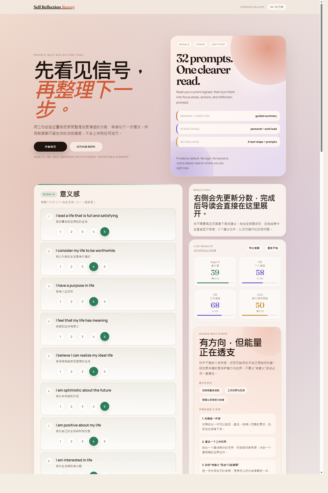

# Version Gallery

This page keeps a visual record of major UI milestones so older versions stay easy to reference even after `main` moves forward.
Each entry should point back to an immutable reference such as a commit SHA, merged PR, tag, or release.

## How We Use This

- `README.md` shows the latest UI only
- Pull requests should include before/after screenshots for review context
- This gallery keeps the longer-lived screenshot archive for portfolio and version history

## v1 · Initial GitHub Pages Release

- Date: 2026-04-05
- Context: first public baseline hosted on GitHub Pages
- Reference: commit [`b7dec29`](https://github.com/teohsinyee/self-reflection-survey/commit/b7dec29)

## v2 · Actionable Results Guidance

- Date: 2026-04-06
- Context: adds a profile-style results guide, suggested focus areas, next-step actions, and reflection prompts after the survey is completed
- Reference: implementation commit [`7c12341`](https://github.com/teohsinyee/self-reflection-survey/commit/7c12341) · [PR #2](https://github.com/teohsinyee/self-reflection-survey/pull/2)

## v3 · Editorial UI Redesign

- Date: 2026-04-06
- Context: rebuilds the app into a warmer editorial-style experience with a poster-like hero, clearer workspace layout, single-language switching, and source notes for the reflection framework
- Reference: implementation commit [`3996dad`](https://github.com/teohsinyee/self-reflection-survey/commit/3996dad)

## Maintenance Notes

- Create a new screenshot folder under `docs/screenshots/` for each notable UI version
- Add 1 to 3 images that show the most important state of that version
- Update the README screenshot only when the latest version changes
- Keep historical screenshots here even after the UI is redesigned again
